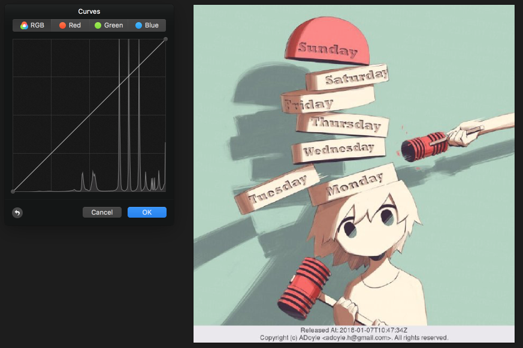
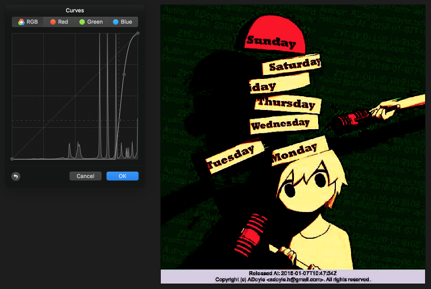

# watermark

A bash command to make watermarks on image. The tool is based on [ImageMagick][] and [Ghostscript][]. Most image formats are supported.

## TOC

<!-- MarkdownTOC GFM -->

- [Dependencies](#dependencies)
- [Installation](#installation)
- [Usage](#usage)
- [Example](#example)
    - [Reveal the watermarks](#reveal-the-watermarks)
    - [Change the author info](#change-the-author-info)
    - [Change the annotate text](#change-the-annotate-text)
    - [Change watermarks text](#change-watermarks-text)
    - [Change the transparency degree of watermarks text](#change-the-transparency-degree-of-watermarks-text)
- [Versioning](#versioning)
- [Copyright and License](#copyright-and-license)

<!-- /MarkdownTOC -->

## Dependencies

- GNU bash, 4.4.12(1)-release or above
- ImageMagick v7.0.7 or above
- Ghostscript v9.22

## Installation

1. `git clone https://github.com/adoyle-h/watermark.git <repo-path>`
2. `ln -s <repo-path>/bin/watermark /usr/local/bin/watermark`

## Usage

Enter `watermark` for help.

## Example

The origin image:

Output:

### Reveal the watermarks

Adjust the color curves.

Origin Covered:

Adjusted Covered:

### Change the author info

Defaults to my contact. You should set yours.

`watermark -a <your-name> <image>`

### Change the annotate text

`watermark --annotate <text> <image>` to change the whole annotate text on footer

### Change watermarks text

`watermark -t <text> <image>`

### Change the transparency degree of watermarks text

`watermark -d <number> <image>`

`watermark -d 50 ./docs/img/origin.jpg`

Output:

## Versioning

The versioning follows the rules of SemVer 2.0.0.

**Attentions**: anything may have **BREAKING CHANGES** at **ANY TIME** when major version is zero (0.y.z), which is for initial development and the public API should be considered unstable.

For more information on SemVer, please visit http://semver.org/.

## Copyright and License

Copyright (c) 2018 ADoyle. The project is licensed under the **Apache License Version 2.0**.

See the [LICENSE][] file for the specific language governing permissions and limitations under the License.

See the [NOTICE][] file distributed with this work for additional information regarding copyright ownership.

<!-- Links -->

[LICENSE]: ./LICENSE
[NOTICE]: ./NOTICE

[ImageMagick]: https://www.imagemagick.org/
[Ghostscript]: https://www.ghostscript.com/
